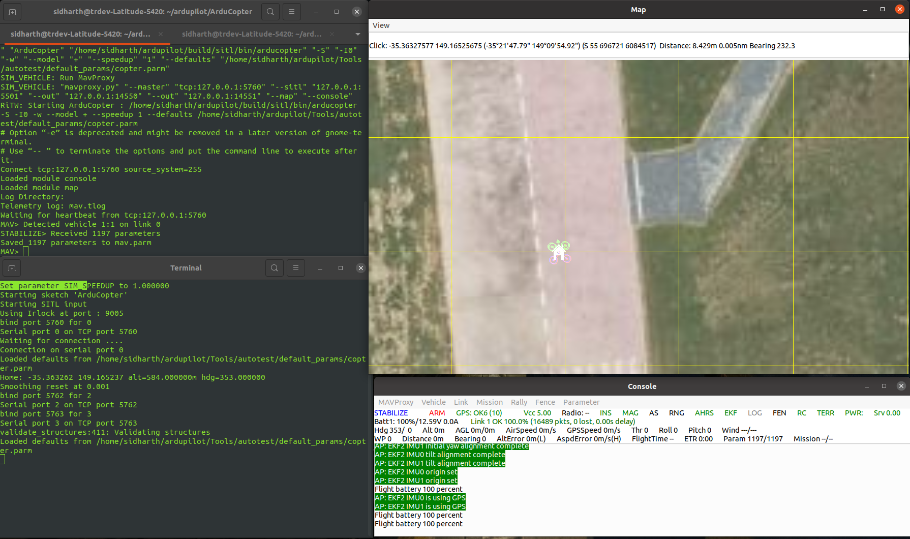
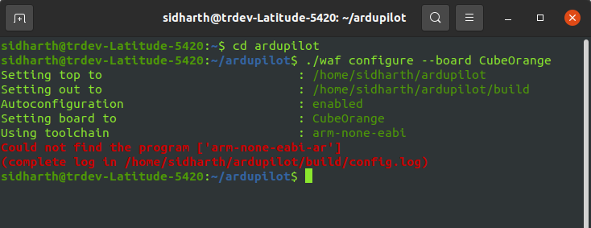

# Installing-ArduPilot-and-MAVProxy-on-Ubuntu-20.04
Below is a detailed guide for installing ArduPilot and MAVProxy on Ubuntu 20.04. 

Please note that this guide assumes a clean Ubuntu 20.04 installation.

# Install ArduPilot:
### 1. Update and Upgrade:
Open a terminal and run the following commands:
```bash
sudo apt update
sudo apt upgrade -y
```

### 2. Clone ArduPilot Repository:
Clone the ArduPilot repository:

```bash
cd ~
sudo apt install git
git clone https://github.com/ArduPilot/ardupilot.git
cd ardupilot
git checkout Copter-3.6
git submodule update --init --recursive
```
### 3. Install Dependencies:
Install dependencies needed for ArduPilot:

```bash
sudo apt install python-matplotlib python-serial python-wxgtk3.0 python-wxtools python-lxml python-scipy python-opencv ccache gawk python-pip python-pexpect

sudo apt install -y git python3-dev python3-opencv python3-wxgtk4.0 libxml2-dev
```
### 4. Build ArduPilot for a specific flight controller (Optional):
Build ArduPilot using the following commands:

Note: 

* You have already build Copter-3.6.

* To configure for a specific flight controller, use the following command:

```bash
cd ardupilot
./waf configure --board [Board_Type]

```
Replace [Board_Type] with the appropriate board type. 

For example:

* For CubeBlack:

```bash
cd ardupilot
./waf configure --board CubeBlack
```
* For CubeOrange:

```bash
cd ardupilot
./waf configure --board CubeOrange
```
After configuring, build ArduPilot:
```bash
./waf copter
```

To view the available board options for configuring ArduPilot, you can use the following command:

```bash
./waf list_boards
```


# MAVProxy Installation

### 1. Install Pip (Python Package Installer):
```bash
sudo apt-get install python3-pip
```
### 2. Install MAVProxy
```bash
sudo pip3 install MAVProxy
```
### 2. Update ~/.bashrc for ArduPilot:

##### This step is to run ArduPilot commands from any directory in the terminal.

#### a. Open ~/.bashrc for Editing:

```bash
gedit ~/.bashrc
```
This command opens the ~/.bashrc file in the gedit text editor. If you prefer a different text editor, you can replace gedit with the name of your preferred editor.

#### b. Add Lines to the End of ~/.bashrc:

Once the text editor opens, go to the end of the file and add the following lines:

```bash
export PATH=$PATH:$HOME/ardupilot/Tools/autotest
export PATH=/usr/lib/ccache:$PATH
```

These lines add the specified paths to the PATH environment variable. Save the file after making these additions.

#### c. Save and Close the Text Editor:

Save the changes you made in the text editor and close it.

#### d. Reload ~/.bashrc:

To apply the changes without restarting your terminal, run the following command:

```bash
. ~/.bashrc
```
This command "sources" the ~/.bashrc file, making the changes take effect in the current terminal session.

Now, the specified directories are included in your PATH, making it convenient to run ArduPilot commands from any directory in the terminal.

# Run SITL & MAVProxy

### 1. Run SITL (Software In The Loop) to Set Parameters:
Open a terminal and navigate to the ArduCopter directory within your ArduPilot folder:

```bash
cd ~/ardupilot/ArduCopter
```
Start the simulation with the specified vehicle type. Adjust the vehicle type as needed for your simulation:

```bash
sim_vehicle.py -v ArduCopter -w --console --map
```
This command initializes the Software In The Loop (SITL) simulation with the specified ArduCopter vehicle type. It allows you to set parameters and perform testing in a simulated environment.

### 2. Run MAVProxy to Interface with SITL:

Open a new terminal window.

Run MAVProxy to establish communication with the SITL instance:

```bash
mavproxy.py --master tcp:127.0.0.1:5760 --sitl 127.0.0.1:5501 --out 127.0.0.1:14550 --out 127.0.0.1:14551
```
`--master tcp:127.0.0.1:5760`: Specifies the connection to the SITL instance.

`--sitl 127.0.0.1:5501`: Specifies the SITL location.

`--out 127.0.0.1:14550 --out 127.0.0.1:14551`: Specifies output ports for communication.

`--console`: Opens the MAVProxy console for interaction.

This command establishes a MAVLink connection between MAVProxy and the SITL instance, allowing you to monitor and control the simulated vehicle. The --console option opens an interactive console for sending MAVLink commands.



  #### If everything works well, then it should looks like this. :) 

Ensure that the SITL simulation is running before starting MAVProxy. The provided commands assume that your ArduCopter directory and simulation settings are correctly configured.


# MAVProxy Commands and Examples

MAVProxy commands, ensure you have completed the above steps.

Below is a guide on common MAVProxy commands and examples on how to use them effectively.

[MAVProxy Commands and Examples](https://github.com/sidharthmohannair/MAVproxy-examples)


## Handling the errors while configuring the flight controllers

### Error 1: Could not find the program ['arm-none-eabi-ar']



The error message indicates that the arm-none-eabi-ar program is not found, which is part of the ARM toolchain needed for building ArduPilot. Let's address this by installing the necessary toolchain.

#### Follow these steps:

#### Install ARM Toolchain
1. Open a terminal.

2. Install the ARM toolchain:

```bash
sudo apt-get install gcc-arm-none-eabi -y
```
3. After installing, run the `./waf configure --board CubeBlack` command again:

```bash
./waf configure --board CubeBlack
```
#### Additional Steps (if needed)
If the issue persists, you may need to install additional packages. 

Run the following commands:

```bash
sudo apt-get install libncurses5 libncurses5-dev
sudo apt-get install autoconf2.13
```

After installing these packages, attempt the ./waf configure --board CubeBlack command once more.

#### Retry Configuration

1. Retry the configuration:

```bash
./waf configure --board CubeBlack
```
2. If successful, proceed to build ArduPilot:

```bash
./waf copter
```
#### Note

If you encounter further issues during the configuration or build process, carefully review the error messages. They often provide insights into missing dependencies or required packages.

### Error 2: bad interpreter: No such file or directory
```bash
sidharth@asus:~/ardupilot$ ./waf configure --board CubeOrange
./waf: /usr/bin/python: bad interpreter: No such file or directory
sidharth@asus:~/ardupilot$ ./waf list_boards
./waf: /usr/bin/python: bad interpreter: No such file or directory
```
The error `bad interpreter: No such file or directory` typically indicates that the Python interpreter specified in the shebang line of the script is not found in the specified path. In this case, it looks like the python executable is not found in `/usr/bin/python`.

To resolve this issue, you can follow these steps:

#### Check Python Version:

Open a terminal and check the version of Python installed on your system by running:

```bash
python --version
``` 

If you have Python 3 installed and want to use it instead of Python 2, you can create a symlink from `python` to `python3`. Run the following commands:

```bash
sudo ln -s /usr/bin/python3 /usr/bin/python
```

If you face additional difficulties, feel free to share the error messages, and I'll do my best to assist you further.

## Reference
This guide should help you install ArduPilot, MAVProxy. Make sure to refer to the official documentation for any updates or additional configuration steps:

[ArduPilot Documentation](https://ardupilot.org/ardupilot/)

[MAVProxy Documentation](https://ardupilot.org/mavproxy/)

[Ardupilot Wiki](https://github.com/ArduPilot/ardupilot_wiki/blob/master/mavproxy/source/docs/getting_started/starting.rst) 

[Installing Ardupilot and MAVProxy](https://github.com/Intelligent-Quads/iq_tutorials/blob/master/docs/Installing_Ardupilot.md)

## Contributing

Pull requests are welcome. For major changes, please open an issue first
to discuss what you would like to change.

Please make sure to update tests as appropriate.
